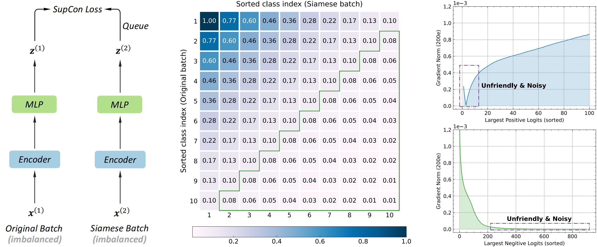
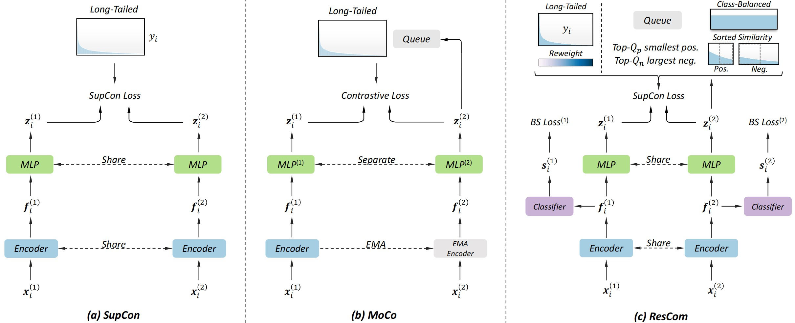
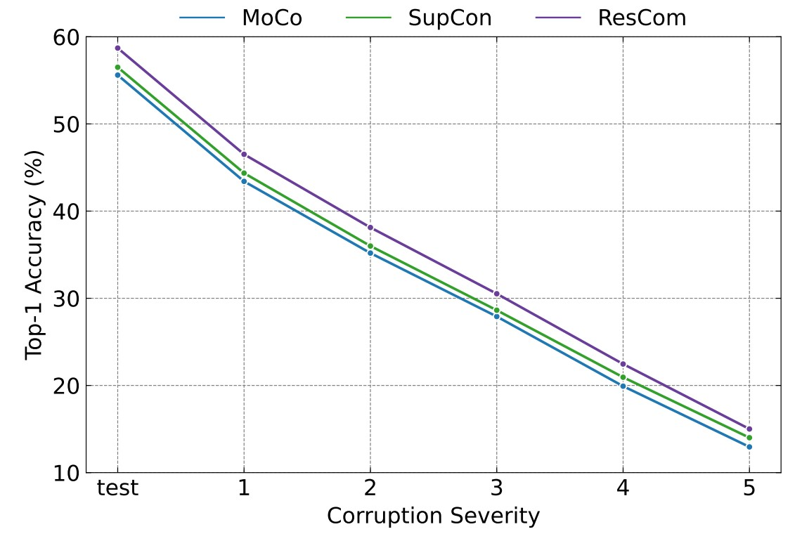

# ResCom
**Rebalanced Siamese Contrastive Mining for Long-Tailed Recognition**

**Authors**: Zhisheng Zhong, Jiequan Cui, Zeming Li, Eric Lo, Jian Sun, and Jiaya Jia

[[`arXiv`](https://arxiv.org/abs/2203.11506)]


## Overview


<div align="center">
  
</div><br/>

In this paper, we propose **Re**balanced **S**iamese **Co**ntrastive **M**ining (**ResCom**) to tackle imbalanced contrastive recognition. Based on the mathematical analysis and simulation results, we claim that supervised contrastive learning suffers ***a dual class-imbalance problem at both the original batch and Siamese batch levels***, which is more serious than long-tailed classification learning. ResCom contains four modules for better imbalanced learning:

- At the original batch level, we introduce a class-balanced supervised contrastive loss to assign adaptive weights for different classes. 

- At the Siamese batch level, we present a class-balanced queue, which maintains the same number of keys for all classes.  

- Easy positives and easy negatives will make the contrastive gradient vanish. Supervised hard positive and negative pairs mining  picks up informative pairs for contrastive computation and improve representation learning. 

- To approximately maximize the mutual information between the two views, Siamese Balanced Softmax is proposed and can be jointly trained with the contrastive loss in one-stage.

Extensive experiments demonstrate that ***ResCom improves robustness and generalization and outperforms the previous methods by large margins*** on multiple long-tailed recognition benchmarks. 

<div align="center">
  
</div><br/>


## Dependence

**Requirements**

* torchvision 0.8.0
* Pytorch 1.8.0
* yacs 0.1.8

**Dataset Preparation**

* [CIFAR-10 & CIFAR-100](https://www.cs.toronto.edu/~kriz/cifar.html)
* [ImageNet](http://image-net.org/index)
* [iNaturalist 2018](https://github.com/visipedia/inat_comp/tree/master/2018)
* [Places](http://places2.csail.mit.edu/download.html)

Change the `data_path` in `config/*.yaml` accordingly.

The data list texts for ImageNet-LT, iNaturalist 2018, and Places-LT can be download through this [link](https://drive.google.com/file/d/196V4HmGZFcooGa841zJgDP4qVndbwtkX/view?usp=sharing).


## Training

To train a ResCom model,  run:

```
python main_rescom.py --cfg ./config/DATASETNAME_xxxx.yaml
```

The saved folder (including logs and checkpoints) is organized as follows.

```
ResCom
├── saved
│   ├── xxxxxx_xxxxxx
│   │   ├── ckps
│   │   │   ├── current.pth.tar
│   │   │   └── model_best.pth.tar
│   │   └── logs
│   │       └── xxxxxx_xxxxxx.log
│   ...   
```


## Evaluation

To evaluate a trained ResCom model, run:

```
python main_rescom.py --cfg ./config/DATASETNAME_xxxx.yaml resume /path/to/checkpoint evaluate True
```


## Recognition Performances and Models

### ImageNet-LT (Orthogonality to Multi-stage Methods)

| Method | Backbone | Top-1 Acc(%) | Checkpoint | Log |
| :---: | :---: | :---: | :---: | :---: |
| ResCom | ResNet-50   | 58.7 | [download]() | [download]() |
| ResCom + MiSLAS | ResNet-50  |     59.2     | [download]() | [download]() |
| ResCom | ResNeXt-50 | 59.2 | [download]() | [download]() |
| ResCom + MiSLAS | ResNeXt-50 | 59.5 | [download]() | [download]() |

### iNaturalist 2018 

| Method | Backbone | Top-1 Acc(%) | Checkpoint | Log |
| :---: | :---: | :---: | :---: | :---: |
| ResCom | ResNet-50   | 75.2 | [download]() | [download]() |

### CIFAR-10-LT

| Method | Backbone  | imb. factor | Top-1 Acc(%) |  Checkpoint  |     Log      |
| :----: | :-------: | :---------: | :----------: | :----------: | :----------: |
| ResCom | ResNet-32 |     100     |     84.9     | [download]() | [download]() |
| ResCom | ResNet-32 |     50      |     88.0     | [download]() | [download]() |
| ResCom | ResNet-32 |     10      |     92.0     | [download]() | [download]() |

### CIFAR-100-LT

| Method | Backbone | imb. factor | Top-1 Acc(%) |     Checkpoint     | Log |
| :---: | :---: | :---: | :---: | :---: | :---: |
| ResCom | ResNet-32  | 100 | 53.8 | [download]() | [download]() |
| ResCom | ResNet-32 | 50 | 58.0 | [download]() | [download]() |
| ResCom | ResNet-32 | 10 | 66.1 | [download]() | [download]() |


## Robustness and Generalization

### Positives Similarity Distribution

<div align="center">
  
</div><br/>

 ###  mCE, NmCE, and Corruption Severity Results on ImageNet-C

<div align="left">
  
</div><br/>

|          Method           | Top-1 Acc(%) |   mCE    |   NmCE   |
| :-----------------------: | :----------: | :------: | :------: |
|  MoCo + Balanced Softmax  |     55.7     |   71.4   |   91.4   |
| SupCon + Balanced Softmax |     56.5     |   71.1   |   91.2   |
|          ResCom           |   **58.7**   | **69.4** | **89.2** |


### t-SNE Visualization of Representation Learning

<div align="center">
  
</div><br/>


## Citation

Please consider citing ResCom in your publications if it helps your research. :)


```
@article{zhong2022rebalanced,
  title={Rebalanced Siamese Contrastive Mining for Long-Tailed Recognition},
  author={Zhong, Zhisheng and Cui, Jiequan and Lo, Eric and Li, Zeming and Sun, Jian and Jia, Jiaya},
  journal={arXiv preprint arXiv:2203.11506},
  year={2022}
}
```


# Contact

If you have any questions, feel free to contact us through email (Zhisheng ZHONG: zszhong@link.cuhk.edu.hk) or Github issues. Thanks!

 

 